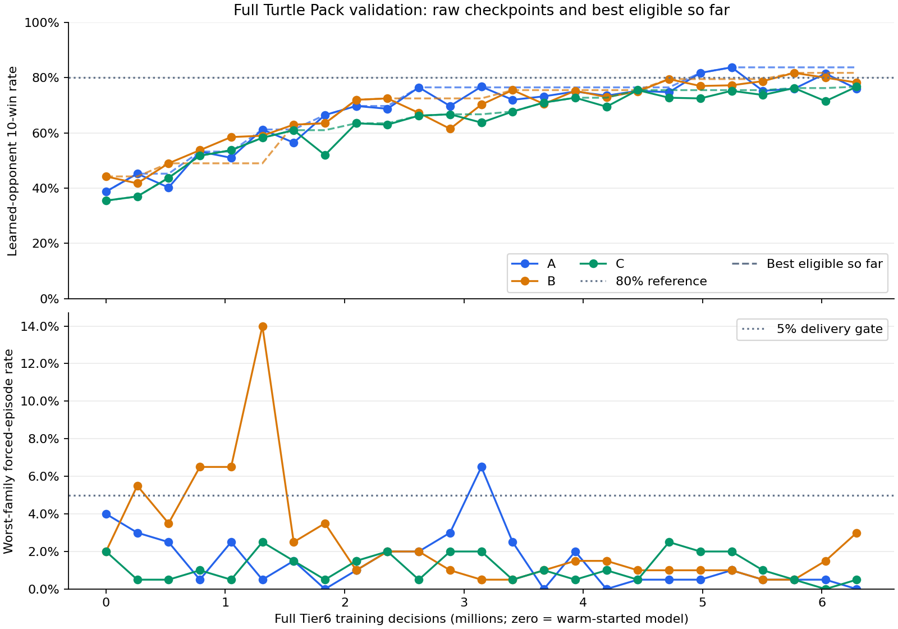

# SAP RL Lab — 60-pet Turtle Pack

A completed educational reinforcement-learning project: build a tested auto-battler,
train a small policy from scratch, diagnose failures, and play against the result.
No foundation model is used.

**Status: full-pack milestone complete, 2026-09-18.** The frozen 0.46 sandbox
supports all 60 ordinary Turtle Pack pets, normal Tier 1–6 shops, 18 ordinary foods,
perks and summon tokens. This is not a certified reproduction of the official client.

[Play against model A](https://sap-rl-replay-lab.dcao2028.chatgpt.site/play.html) ·
[Final report](docs/PROJECT_WRAPUP.md) ·
[Training result](docs/FULLPACK_DELIVERY.md) ·
[Model card](docs/MODEL_CARD.md) ·
[Download checkpoints](https://huggingface.co/DianneDaian/sap-rl-turtle-pack)

The hosted demo may require the owner's ChatGPT login; the complete browser demo
is also in this repository and runs locally without an account.
The public Hugging Face repository is created; checkpoint upload is currently
pending browser file-access permission. See the final report for release status.

## Results

Three independently seeded candidate lineages, checkpoints selected by validation:

| Model | Held-out learned opponents | Fresh-episode confirmation |
| --- | ---: | ---: |
| A · 85101 | 84.7% | 80.6% |
| B · 85201 | 81.0% | 84.1% |
| C · 85301 | 81.1% | 80.9% |
| Mean | **82.27%** (2,468/3,000) | **81.87%** (2,456/3,000) |

These are **ten-win episode success rates against frozen learned-opponent pools**,
not individual battle win rates, human win rates, or official Arena results.
Confirmation uses new episode seeds against the same held-out opponent policies.
Including scripted opponents, both final evaluations cover 15,000 episodes with
zero whole-episode truncations; the worst model/family forced-battle episode rate
is 2%. Reaching the target does not establish convergence.

[Compact evidence and hashes](docs/evidence/fullpack-v1/manifest.json) preserves the
final raw evaluation rows (gzip JSON), selection and audit. Public metadata removes
personal workspace prefixes; original and published hashes are listed separately.



## What the agent learned

- **BC warm start:** imitate heuristic shopping demonstrations to learn usable
  behavior; the teacher is a starting point, not a certified optimal player.
- **Maskable PPO:** improve through simulated play while excluding illegal actions.
- **KL early stopping:** stop a PPO update when policy drift is too large; this is
  not a reward for matching a foundation model or the teacher.
- **Opponent diversity and held-out evaluation:** separate training, validation
  and test pools, with multiple training seeds and validation-based selection.
- **Curriculum:** expand the action/rule environment in versioned stages while
  retaining earlier models and experimental evidence.

The final actor and critic each use a 64×64 Tanh MLP: **341,516 parameters**,
2,531 flattened input features and 139 discrete actions. Inference returns a legal
action; diagnostics expose action probabilities and a critic value, neither a
calibrated win probability.

The final full-pack campaign used 18,874,368 candidate PPO steps plus 7,340,032
opponent PPO steps. Preparation through the first passing test took about two
hours on local CPU, excluding earlier curricula and the final audit.
See the report for exact budgets, reward coefficients and limitations.

## Play locally

The browser runs the original rules and exported model with Pyodide/NumPy.
No GPU or running Python inference service is needed.

```bash
cd viewer
node build.mjs
python3 -m http.server 8765 --bind 127.0.0.1 --directory dist
```

Open [the local game](http://127.0.0.1:8765/play.html).
The first load downloads the browser Python runtime from jsDelivr.
Your game stays in the page; refreshing discards it.
The historical two-lane replay viewer remains at `/index.html`.

## Development and model inference

```bash
python -m venv .venv
source .venv/bin/activate
python -m pip install -e ".[rl,dev]"
python -m pytest
```

Use [the model card](docs/MODEL_CARD.md) for checkpoint loading and the full-pack
environment contract. The old generic CLI still defaults to the eight-pet
environment for historical compatibility; it is **not** the full-pack entrypoint.
Original Torch-checkpoint parity is optional in a fresh clone; set
`SAP_RL_CHECKPOINT` to model A to run it. Exported browser weights and golden
inference fixtures are included.

## Scope and known limitations

- Shopping movement is **adjacent swaps**, not a one-action insert anywhere.
  Reaching the same formation can consume more actions and shaping cost.
  Its causal contribution to looping has not been established.
- 30 shopping actions force a battle; 40 rounds are a computational episode cap.
- The head-to-head browser duel is a different opponent format from the Arena
  evaluation. A user's difficulty beating the bot is qualitative feedback only.
- Some extreme ability ordering/rounding cases remain uncertain. See the
  [versioned rules ledger](docs/FULLPACK_RULES.md).
- Public evidence is a compact result archive, not all 8 GB of local runs.
  No historical checkpoint has been overwritten or deleted.

## Read more

- [Project wrap-up and what we learned](docs/PROJECT_WRAPUP.md)
- [Final recipe and model card](docs/MODEL_CARD.md)
- [BC learning curves](docs/figures/fullpack-final/bc.png)
- [Interview notes](docs/INTERVIEW_RL.md)
- [RL concepts](docs/RL_GUIDE.md) and [architecture](docs/ARCHITECTURE.md)
- [Experiment history / roadmap](docs/ROADMAP.md)
- [Earlier eight-pet release and artifact restoration](docs/ARTIFACTS.md)
- [Browser inference design and verification](viewer/duel/README.md)

## Attribution

Inspired by Super Auto Pets by Team Wood Games; no affiliation or endorsement.
Native emoji are used instead of game artwork. The architecture was informed by
the MIT-licensed `sapai`, `sapai-gym` and `super-ml-pets` projects.
See [third-party notices](THIRD_PARTY_NOTICES.md). Project code is MIT licensed.
