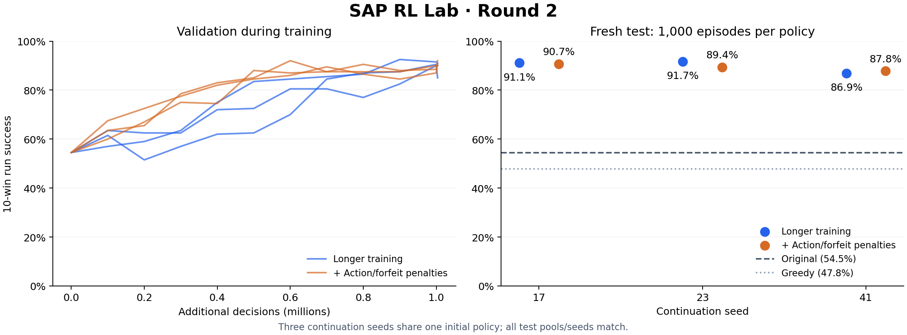

# Second experiment: inefficient shop loops

## Completed result

The corrected experiment completed six runs, each with 1,003,520 additional
decisions (one full rollout beyond the requested 1 million). Training plus
validation took 811 seconds total on the local CPU. Each validation-selected
policy was then tested on 1,000 fresh episode seeds against the reserved test
league. Original PPO and both scripted controls used that same test protocol.

| Policy | 10-win success | Mean wins | Mean return | Cutoffs |
|---|---:|---:|---:|---:|
| Original saved PPO | 54.5% | 6.715 | 3.107 | 2.9% |
| Spend-gold heuristic | 47.8% | 5.862 | 1.968 | 0.0% |
| Random legal actions | 0.0% | 0.033 | -4.806 | 9.7% |
| Longer training, seed 17 | 91.1% | 9.330 | 7.575 | 1.8% |
| Longer training, seed 23 | 91.7% | 9.403 | 7.568 | 0.7% |
| Longer training, seed 41 | 86.9% | 9.103 | 7.090 | 4.2% |
| Added penalties, seed 17 | 90.7% | 9.292 | 7.388 | 0.5% |
| Added penalties, seed 23 | 89.4% | 9.177 | 7.176 | 0.4% |
| Added penalties, seed 41 | 87.8% | 9.092 | 6.955 | 0.8% |

The three-seed mean success was **89.9% for longer training** and **89.3% with
the added penalties**. All three episode-paired bootstrap intervals for the
success-rate difference between arms include zero. The penalties reduced mean
cutoffs from 2.23% to 0.57%, but did not consistently reduce action count or
improve raw return. They remain opt-in experimental settings, not the default.

The practical recommendation is the unshaped continuation workflow with fixed
autoreset seeding and validation selection. Among its three runs, seed 23 has
the highest validation score (92.5%, at 900,000 additional decisions); that
saved checkpoint scores 91.7% on the fresh test. The last checkpoint was not
automatically selected. The original policy's 54.5% here differs from its
earlier 59.0% because this is a new opponent pool and new episode seeds.



[Download the plotted metrics](assets/round2/comparison.csv) or
[the vector figure](assets/round2/comparison.svg).

This measures improvement from a shared initialization against unseen snapshots
of the same scripted opponent family. It does not demonstrate skill against
human players, all Turtle Pack mechanics, unseen opponent strategies, or
independent training from scratch.

Verification included 34 passing tests, an exact repeat of 8,192-step training
(all 12 weight tensors and 108 completed episode reward/length pairs matched),
and an audit of all 9,000 test-episode rows, six selected model hashes, equal
budgets, source revision, and distinct training/validation/test file hashes.
The experiment source revision is `2ea44615d3a24b023575a498f987ea9604a356f1`.

## Evidence and hypothesis

The pilot also exposed an automatic-reset seeding bug: after the first episode,
Gym's `reset(seed=None)` reached the pure engine as `random.Random(None)`, drawing
system entropy and defeating the configured training seed. Automatic resets now
derive episode seeds from each environment's persistent seeded Gym RNG. Explicit
evaluation seeds keep their original meaning. Vector-autoreset regression tests
verify distinct, reproducible episode streams. The preliminary unseeded
comparison was interrupted and excluded; the final comparison uses the fix in
both arms.

The saved first policy was replayed locally on exactly the original 500 seeds
and held-out pool. All summary metrics matched the original GPU evaluation.
Detailed action logging showed 10,491 adjacent swaps out of 38,111 decisions
(27.5%). All 17 truncated episodes hit the 30-action shop limit. Failure traces
repeatedly swapped the same adjacent pair, sometimes even identical pets.

The original Gym adapter marks those failures as truncations. Maskable PPO
bootstraps its value estimate at a truncation. That is suitable for an external
time interruption, but can assign optimistic value beyond an agent-caused
safety cutoff. Also, the existing -1 cutoff penalty can be cheaper than playing
out several losing battles. These are mechanisms to test, not proof that the
policy intentionally exploits the cutoff.

The proposed **efficient** training objective introduces two explicit changes:

- Every decision costs 0.005 reward, making long zero-reward loops costly.
- Hitting a safety limit forfeits remaining lives and ends the training
  episode without value bootstrapping. The existing -1 shop-limit penalty is
  replaced, rather than charged twice. At the turn limit the final battle
  reward is retained before the remaining-life penalty.

This shaping changes the optimization objective; it is not guaranteed to
preserve every optimal strategy. All candidate policies are therefore evaluated
using the original game rewards, full legal-action masks, and original cutoffs.
No strategic action is removed. Evaluation reports raw returns and 10-win
success, plus swap counts, unspent gold, and failure reasons.

Sources: [Gymnasium's termination and truncation explanation](https://gymnasium.farama.org/tutorials/gymnasium_basics/handling_time_limits/)
and [Maskable PPO's rollout implementation](https://sb3-contrib.readthedocs.io/en/master/_modules/sb3_contrib/ppo_mask/ppo_mask.html).

## Comparison protocol

`sap_rl_lab.experiments` writes its full protocol and file hashes before training.
It runs one experiment at a time in a new directory and refuses to overwrite
existing results.

Both arms start from the same first-run policy weights with fresh optimizer
state, use the same training league and PPO settings, and receive the same
additional decision budget. **Control** continues the original objective.
**Efficient** enables the two changes above. This separates the combined
intervention from simply training longer. It does not isolate the contributions
of the two changes individually.

The full protocol uses continuation seeds 17, 23, and 41, with 1 million
additional decisions per arm and seed. These share a pretrained initialization;
they are not independent experiments from scratch.

- Training league: exact first-run pool.
- Validation league: 100 scripted episodes beginning at seed 30000.
- Validation episodes: seeds 40000–40199 every 100,000 decisions and at the end.
- Test league: 100 scripted episodes beginning at seed 50000.
- Final test episodes: seeds 60000–60999.

Checkpoint selection uses validation success, then validation return, with the
earliest checkpoint winning exact ties. The untouched initial policy is also a
candidate. The test pool is evaluated only after all training and selection.
Original PPO, greedy, and random policies use the same final test protocol.

Every evaluation includes per-episode rows for paired comparisons and the
opponent-pool hash. Bootstrap intervals quantify episode-sampling uncertainty
for fixed policy pairs; they do not establish uncertainty over independent
training runs. Report each continuation seed and the mean without treating
shared test episodes as independent training replicates.

## Running

With the first-run artifacts in `BASE_RUN`, use a fresh `OUTPUT` path:

```bash
python -m sap_rl_lab.experiments --base-run BASE_RUN --output OUTPUT
```

For a short validation-only pilot:

```bash
python -m sap_rl_lab.experiments --base-run BASE_RUN --output OUTPUT \
  --timesteps 200000 --seeds 17 --pilot
```

`cluster/round2.sbatch` runs the full comparison in one bounded Slurm allocation.
Pass an existing personal Python environment as `SAP_RL_PYTHON` and the first-run
directory as `SAP_RL_BASE_RUN`. No dependency installation or shared software
changes are required. Use a fresh versioned checkout for the source and supply
site-specific routing privately at submission.

For the tested local configuration, add `--device cpu --vector-backend dummy`.
The tensor operations use one CPU thread. The measured throughput belongs to
this configuration and hardware; it is not a controlled CPU-versus-GPU hardware
comparison. The cluster connection was unavailable, so this completed round
used no cluster allocation.

To regenerate the figure after installing the optional `plots` extra:

```bash
python scripts/plot_round2.py OUTPUT NEW_FIGURE_DIRECTORY
```
