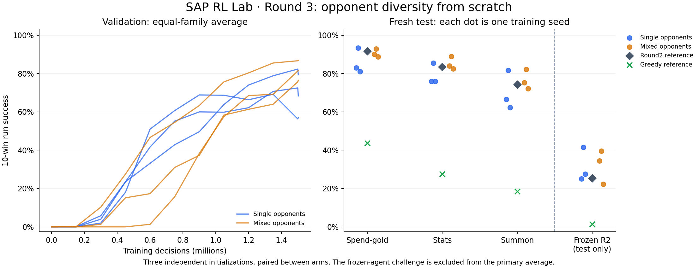

# Round 3 — opponent diversity, from scratch

## Outcome — completed September 5, 2026

Mixed-opponent training improved the equal-family test success rate from **78.36%
to 84.04%**, averaged over three fresh training seeds: **+5.69 percentage points**.
Each paired seed improved on this primary aggregate. Mean cutoff rates fell from
8.74% to 2.33%, but one mixed run still had 5.57% cutoffs, so the predeclared
reliability target was **not met**. Performance on the unseen learned-opponent
challenge did not improve consistently.

The six training budgets and 36,000 final test episodes are complete. No training
is left running. The bounded study stops here; this is evidence of useful
learning, not a solved game or verified live-SAP parity. A Fish level-up concern
found after the source freeze is documented below and remains unfixed in this
experiment.

Post-experiment update: Fish is fixed in a new rules-v2 catalog. These results
and the [18-episode replay viewer](REPLAY_LAB.md) retain the original rules;
no corrected-rules retraining has been performed.

Start with [the five decision exercises](round3-exercises/EXERCISES.md), or jump
to [the full result table](#results). The sections below preserve the experiment's
declared design and explain its limitations.

## Predeclared question and boundary

Does a frozen mixture of opponent strategies improve generalization over one
scripted opponent family when PPO starts from scratch? This is the final bounded
experiment for the eight-pet educational sandbox, not a claim to solve live SAP.

There are six formal runs: single-family and mixed-family training, paired at
initialization seeds 101, 211, and 307. Each receives 1,500,000 requested shop
decisions, rounded up by PPO to a complete 4,096-decision rollout. Both arms use
the existing MLP Maskable PPO, eight environments, CPU/DummyVecEnv, one tensor
thread, learning rate 0.0003, gamma 1, GAE lambda 0.95, batch size 256, and no
additional reward penalties. Three seeds are descriptive evidence, not a precise
estimate of all possible training outcomes.

## Preflight findings

Nine representative Round 2 episodes (a success, ordinary loss, and cutoff from
each unshaped continuation) replayed exactly, matching recorded reward, action
count, and wins. The repeat-swap/freeze loops were legal policy behavior. They
did not reveal state corruption. Original rewards, masks and episode-ending
semantics remain frozen for this experiment; the truncation/bootstrap limitation
is retained and reported, not declared solved.

One real serialization bug was fixed before generating pools: snapshots omitted
temporary shop buffs, such as Horse's buff to a newly bought pet. Schema v2 now
preserves temporary attack and health. Old v1 pools load with zero defaults,
preserving the meaning of prior stored data; historical files were not rewritten.
This changes newly generated opponent teams and prevents a direct numerical
comparison with the old test suite. Round 2's selected agent is reevaluated on
the new benchmark as a frozen reference.

## Opponents

- Greedy: the existing spend-gold script, merging, filling, then feeding.
- Stats: prefers base-stat value and Fish, feeds stronger pets, orders stronger
  pets toward the front.
- Summon: prefers Horses and Crickets, buys Honey for non-Horses, and moves
  Horses behind other pets before combat.

These are simple frozen heuristics, not optimized search agents. Every team is
captured immediately before a battle after legal shopping under the same gold
and round rules. Both new scripts cap ordering work before the action limit.
No strategic moves are removed from the learning agent's mask.

The existing snapshot mechanism is round-indexed. If a requested round has no
snapshots, it uses the nearest earlier round; the profile files expose coverage.
The mixed arm draws a family uniformly at each battle, then a snapshot in that
family. The single arm uses the same provider interface with only greedy.

Important design limitation: 100 generation episodes per family gives the mixed
arm roughly three times as many stored teams as the single arm. Exposure budgets
are equal in learner decisions, but this comparison changes both strategic mix
and unique snapshot inventory. It estimates the effect of this practical mixed
pool, not the causal effect of strategy diversity holding pool size constant.
An equal-inventory control would be a separate experiment, not an unreported
change to the frozen protocol.

## Evaluation firewall

For each family, generate 100 episodes per split. Generator seed starts are
100000 for training, 200000 for validation, and 300000 for test, with family
offsets 0, 10000, and 20000. Different streams can naturally reach identical
teams; the split is by independent generation seeds, not deduplication of all
reachable game states.

Validation uses 200 episodes per family, starting at 400000, every 150000
decisions and at the end. Choose each run's checkpoint by equal-family mean
10-win success, then return, preferring the earliest exact tie. The untrained
checkpoint is eligible. The three training seeds begin with different tensor
fingerprints; each single/mixed pair must begin with exactly matching tensors
or training fails before collecting experience.

After all six choices are saved and hashed, evaluate once on 1000 episodes per
family, starting at 500000. The primary score averages greedy/stats/summon
equally. Report each family as well as mean wins, return, and cutoff rate.
Reference policies are the frozen Round 2 agent, greedy, and random, using the
same test conditions. Per-family paired bootstrap intervals describe episode
sampling for fixed policy pairs, not uncertainty over training seeds. Identical
episode seeds do not guarantee identical random event sequences after policies
take different actions.

An additional test-only challenge contains teams generated by the frozen Round
2 agent in 100 legal episodes starting at 360000, against the training greedy
pool. Challenge evaluation starts at 600000. It is excluded from training,
validation, checkpoint selection, and the primary aggregate. This is a frozen
learned-opponent challenge, not online self-play or an estimate of human strength.

Source files, data hashes, package versions, all configs and model fingerprints
are recorded. Source code is archived alongside the experiment. Engineering
smoke tests use a separate seed namespace and are excluded from formal results.

## Stopping and learning deliverable

Run the six budgets once. No hyperparameter search or automatic extension is
authorized by this protocol. The aspirational performance target is for all
three mixed runs to beat the greedy policy on the equal-family primary test and have less than
1% cutoffs overall, with per-family inspection. Missing that target is a result
to explain, not permission for indefinite retries. At most one focused debugging
follow-up should be proposed if a concrete issue justifies it.

The learning deliverable is five development-seed shop situations, with policy
action probabilities, a state-value estimate and a complete replay. The user can
choose before revealing the policy's action. Probabilities describe the policy;
they are not proof of causal action value, and a single outcome can be lucky.
The demonstration model is chosen across the six frozen checkpoints by highest
validation success, then validation return, then lexical run name. It never uses
test scores. Situations use development episode seeds 700000–700004, with fixed
decision indices 2, 5, 10, 15, and 20 (or the last available decision if shorter).
For up to three alternatives per situation, 32 future-rollout samples estimate
the effect of one forced move followed by the deterministic learned policy.
Those estimates are not optimal Q values and are separate from benchmark scores.

## Reproduction

```bash
python -m sap_rl_lab.round3 --output NEW_DIRECTORY --champion ROUND2_BEST_MODEL
```

An interrupted final evaluation can resume from the frozen selection using
`--evaluate-only --output EXISTING_DIRECTORY`. Completed tests cannot be silently
overwritten. A pilot stops without generating or evaluating final test pools.

## Mechanics concern found after the source freeze

While checking the learning exercises, a direct diagnostic reproduced a Fish
level-up indexing problem. The merge implementation raises the pet's experience
before looking up the ability at its new level. With the present catalog, a
level-1 Fish becoming level 2 gives two friends +2/+2; a level-2 Fish becoming
level 3 gives no friend buff, because the level-3 catalog entries are zero.
This is inconsistent with using the departing level's level-up ability.

All six arms retain exactly the same frozen implementation. No checkpoint or
pool was silently regenerated after this discovery. The comparison therefore
describes this simulator, not verified SAP play. Before expanding mechanics,
the one focused follow-up should establish the target game's level-up timing,
correct the indexing if confirmed, and test both Fish level transitions. That
would be a new simulator version; existing Round 3 scores must not be relabeled
as results under the corrected rules.

## What these choices teach

- **Opponent distribution is part of the task.** Keeping PPO and rewards fixed
  makes the changed training opponents the central experimental intervention.
  The larger mixed pool remains a stated confound, not a pure diversity test.
- **Initialization matters.** Fresh starts test learning rather than just
  continuation of one lucky parent model. Matching each pair's initial weights
  removes that one source of difference; the three pairs still vary.
- **Validation chooses; test measures.** Repeatedly choosing checkpoints against
  a validation set can overfit that set. A fresh final test measures the chosen
  procedure without granting another opportunity to tune it.
- **Reward and the headline metric are different.** PPO optimizes expected
  future net battle reward. We select and report ten-win run success. They are
  related, but not mathematically identical objectives.
- **Behavior matters as much as a score.** Legal action masks prevent impossible
  moves, not useless repeated swaps. Replays, cutoff rates and forced-action
  rollouts expose failures that an average return can hide.
- **A finished learning project need not be a solved game.** Finishing the fixed
  study, reporting unfavorable evidence and explaining a policy decision are
  appropriate educational milestones. Live-game parity and broad playing
  strength are separate claims requiring more work.

## Results

Every family cell below is the percentage of **complete episodes reaching ten
wins**, not the percentage of individual battles won. Each cell uses 1,000 fresh
episode seeds. Primary is the equal-weight average of spend-gold, stats, and
summon; cutoffs use those same three families. The challenge column is separate.

| Policy | Spend-gold | Stats | Summon | Primary | Cutoffs | R2 challenge |
|---|---:|---:|---:|---:|---:|---:|
| Single, seed 101 | 83.0% | 76.0% | 66.5% | 75.17% | 12.23% | 25.1% |
| Mixed, seed 101 | 90.0% | 84.0% | 75.2% | 83.07% | 0.60% | 34.4% |
| Single, seed 211 | 93.3% | 85.4% | 81.7% | 86.80% | 2.97% | 41.5% |
| Mixed, seed 211 | 92.8% | 88.9% | 82.1% | 87.93% | 0.83% | 39.5% |
| Single, seed 307 | 81.0% | 76.0% | 62.3% | 73.10% | 11.03% | 27.6% |
| Mixed, seed 307 | 88.7% | 82.5% | 72.2% | 81.13% | 5.57% | 22.3% |
| Frozen Round 2 reference | 91.7% | 83.5% | 74.2% | 83.13% | 0.80% | 25.4% |
| Spend-gold reference | 43.7% | 27.5% | 18.6% | 29.93% | 0.00% | 1.4% |
| Random reference | 0.0% | 0.0% | 0.0% | 0.00% | 8.53% | 0.0% |

The primary paired improvements are +7.90, +1.13, and +8.03 percentage points
for seeds 101, 211, and 307. These are all three pairs, not the best seed from
each arm. The old Round 2 policy is a reference, not a compute-matched arm.



The left panel shows all evaluated checkpoints, including later declines. The
right panel uses the checkpoint selected within each run by validation, which
is not necessarily that run's last model. Raw per-family metrics, including
mean wins, return, actions and cutoffs, are in the
[comparison CSV](assets/round3/comparison.csv).

### What improved, and what did not

The practical mixed pool helped on this three-family benchmark. It also reduced
looping, but did not reliably remove it. For example, mixed seed 307's stats-test
episode 500021 ended after repeatedly choosing `swap_adjacent:2,3`. All 167
primary-test cutoffs for that run were shop-action-limit endings, not ordinary
losses. Passing legality tests does not make those moves strategically sensible.

Generalization beyond the scripted families remains weak. Average challenge
success was 31.40% for single and 32.07% for mixed; two of three mixed seeds
scored worse than their single counterparts there. In seed 307, the mixed arm's
summon success improved by 9.9 points, while challenge success fell by 5.3
points. Their conditional episode-bootstrap 95% intervals were +5.9 to +13.8
and -8.8 to -1.8 points, respectively. Those intervals concern these fixed
models and pools, not the uncertainty of training new seeds or multiple-testing
adjusted proof of a universal benefit.

This supports a narrow conclusion: broader scripted training improved the
selected agents' average score on fresh teams from those scripted families.
It does not establish broad strategic robustness, and the larger mixed snapshot
inventory prevents attributing the gain solely to strategy diversity.

### Checkpoints and teaching examples

Selected decision counts were 1,500,000 / 1,503,232 for the single/mixed seed-101
pair, 1,500,000 / 1,503,232 for seed 211, and 1,350,000 / 1,503,232 for seed 307.
Every run still consumed its complete 1,503,232-decision budget; selection can
retain an earlier checkpoint.

The demonstration checkpoint is **mixed seed 211**, selected by its 86.83%
validation score before consulting final tests. Its primary test score was
87.93%; it is not a claim that every fresh run will reach that level. The
[worksheet](round3-exercises/EXERCISES.md) contains five exact, replay-verified
development episodes and 32 sampled continuations per candidate action.

Two useful lessons from those examples:

- In situation 2, forcing a swap produces the same sampled returns as ending
  the turn. A direct follow-up inspection shows the policy swaps straight back,
  then ends the turn. A one-move deviation test includes the continuation policy;
  it does not force that new ordering to persist.
- In situation 5, the policy assigns 89.0% probability to one Fish merge and
  10.6% to another, yet the estimated future returns are 6.03 and 6.19, each
  with standard error about 0.16. This small sample does not clearly establish
  which is better. A confident preference is not proof of optimality.

### Verification and stopping decision

- Six fresh-start runs across three independent initializations, exactly
  matched between arms: **9,019,392 training decisions** total.
- **20.88 minutes of training plus periodic validation on the local CPU**;
  this excludes pool generation, final tests and teaching diagnostics. No lab
  GPU job was submitted for this round.
- **36,000 final episode rows audited**, including model/data/source hashes,
  equal budgets, initialization fingerprints, validation selection, per-family
  aggregation and episode outcomes. The 41 automated tests and lint checks pass.
- All three mixed seeds beat the 29.93% scripted reference. Two of three met the
  below-1% overall cutoff target; the third did not. **The joint target failed.**

The right stopping decision is to close this bounded learning experiment, retain
the failures, and work through the exercises. Do not keep adding training until
the weakest seed looks good. If continuing the software, the one focused next
step is Fish level-up verification and regression tests before any new mechanics
or training. The broader cutoff issue remains a documented limitation, not an
automatic additional experiment.

The practical learning checkpoint is being able to explain observation, action
mask, delayed reward, critic value, and why validation differs from testing using
one real shop state. That is a human learning goal; a high model score cannot
complete it on the learner's behalf.

Local raw evidence is preserved under `runs/round3-full-v1`: `protocol.json`,
`source.zip`, `selection.json`, `audit.json`, `summary.json`, per-run manifests,
validation histories, checkpoints and all 36 family test reports. The earlier
replay audit is in `runs/round3-audit-v1`. These ignored run artifacts are not
bundled into Git; the report, chart, CSV, and teaching examples are in `docs/`.
